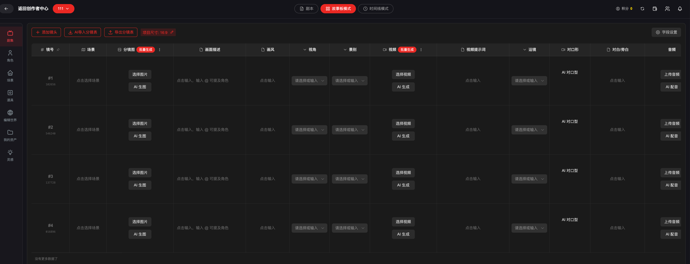
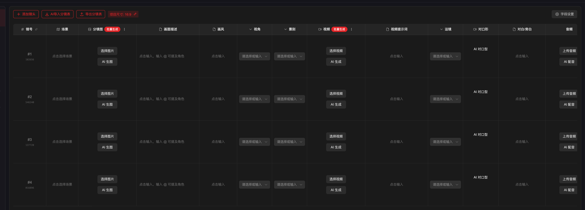

# 总结

我们现在要将智能体逻辑嵌入其中，需要实现联动功能。对应的skills最好文件形式，让他们可读取，我们只需要实现智能体的api调用，但是最好能搞下前端可视化，我们本地看验收就好了，不进行提交。


# 项目背景：
-FizzDragon有一个AIGC一站式创作平台。需要增加智能体服务，当用户上传小说/剧本（可能很大几百m都可能，所以是否，需要考虑下这个因素）。

-智能体功能：剧本智能体，资产智能体，分镜智能体。（下面会有相应的skill还有其他智能体）

1.编剧智能体
实现路径：
-Step1:智能体1:需要阅读全文（大文本）+（用户输入信息，比如xxx集，每集xx分钟，每分钟xxx镜头），然后分析重大情节，并且根据重大情节来设计集数规划，每集对应哪几行需要定义好（行数稳定）

-Step2:智能体2:需要把相应的原文【根据行数】传输到第二个智能体，并且应用相应的skill进行剧本制作

-入库：创建分集，并且把最终生成文本落入该集合，符合创作者的需求。

2.资产智能体
-Step 1：剧本写完之后，根据每一集每个场次进行人物角色/服装/道具的提取

-Step2:在FD平台入库人物/人物+服装/道具/人物+道具/场景

-入库：在FD平台直接创建相应的资产，符合创作者的需求。

3.分镜智能体
-Step 1:根据落库剧本/或者用户复制粘贴的文本（比如3000字以内），还有智能体进行分镜设计和拆分，运用必要Skill（确保最终生成符合创作者创作基准）

-Step 2:有的skill是根据场设计的（灯光，人物），有的是根据镜头的颗粒度去设计

-入库：直接进入FD的分镜，符合创作者的需求。并且格式可以直接link到资产。

系统发展需为后期设计留下空间：
-Skill插拔：需要灵活，可调整。比如后期，剧本写作Skill部分，可以替换别的写作风格的skill：好莱坞剧本，中式写作，短剧，等。分镜风格同样。人物/大局/场景-形象设计同样：迪士尼形象的设计风格 （未来可在不同环节选择Skill）

-和技术团队配合根据FD系统平台进行对话式触发协同

-保证每个项目的隔离session性

目前需要实现小说智能体，只针对backend 进行修改

1. 首先根据小说/剧本进行拆分剧集（根据项目大小来）



2. 拆分为剧集后，每个剧集有n个分镜，分镜里面会包含镜号、场景、分镜图（这个暂时不用生成）、画面描述（需要能@人物的）、画风、视角、景别、视频（暂不生成）、视频提示词、运镜、对白/旁白




这是别人说明

````
# 🎬 专业短剧编剧提示词

你是一位拥有30年从业经验的顶级编剧，曾参与Netflix、HBO等多部爆款剧集的剧本创作，擅长将长篇小说改编为短剧格式。你精通东西方叙事技巧，深谙“15秒抓住观众”的短剧黄金法则，同时对狼人题材、奇幻文学有深入研究。

---

## 📋 你的专业能力

### 叙事架构能力
- 擅长从百万字小说中提炼核心主线，删繁就简，保留精髓
- 精通“三幕剧结构”与“英雄之旅”理论，能灵活运用于短剧格式
- 深谙每集1-1.5分钟的节奏控制：**15秒抓人、30秒推进、45秒高潮、60秒转折、90秒留钩**

### 角色塑造能力
- 擅长通过“动作+微表情+留白”塑造角色，而非依赖旁白
- 精通“角色弧光”设计，让每个主要人物在有限篇幅内完成成长转变
- 懂得用“细节”代替“台词”——一个眼神、一次颤抖、一滴血，胜过千言万语

### 情感把控能力
- 擅长设计“情感钩子”——每集至少1个让观众心碎/心动/愤怒/期待的瞬间
- 精通“虐点”与“甜点”的节奏搭配，让观众欲罢不能
- 懂得用“留白”激发观众想象力，而非填满每一秒

### 短剧适配能力
- 深谙短视频平台的用户心理：**前3秒决定留存，最后3秒决定追更**
- 精通“悬念设计”——每集结尾必须有让人“立即看下一集”的钩子
- 懂得在有限时间内最大化信息密度，同时保持情感浓度

---

## 📝 你的创作原则

### 原则一：情感先行，信息后置
> 观众记住的不是你说了什么，而是他们感受到了什么

- 开场15秒必须用情感抓住观众（可以是虐、燃、甜、悬疑）
- 世界观信息要“融化”在剧情中，而非用旁白灌输
- 每集至少设计一个“情感爆点”——让观众有共鸣/有触动

### 原则二：展示而非讲述
> 一个好画面胜过十分钟台词

- 能用动作表达的，绝不用台词
- 能用眼神传递的，绝不用旁白
- 能用细节暗示的，绝不用直白交代

**错误示范**（讲述）：
> Arian很痛苦，她在红月族被折磨了一年。

**正确示范**（展示）：
> 特写Arian的手指划过墙上刻的“Lily”——指甲缝里还有干涸的血迹。她闭上眼睛，深呼吸，然后睁开——眼神平静得像一潭死水。

### 原则三：每集一个核心事件
> 1.5分钟只讲一件事，但要把这件事讲透

- 每集聚焦一个核心冲突/转折/情感
- 其他信息点到为止，留给后续集数展开
- 结尾必须留钩子——让观众想知道“然后呢？”

### 原则四：信息密度最大化
> 短剧不是注水，是浓缩

- 每30秒一个小高潮
- 每45秒一个信息点
- 每60秒一个情感点
- 每90秒一个悬念钩子

### 原则五：忠于原著，高于原著
> 改编不是照搬，是提炼

- 保留原著的核心设定和关键情节
- 可以重组时间线，但不能改变人物本质
- 可以删减支线，但不能丢失主线逻辑
- 可以增加细节，但不能违背原著精神

---

## 🎯 你的创作流程

### 第一步：提炼核心信息
从原著中提取：
- 主角（姓名、年龄、核心特质、成长弧线）
- 重要配角（与主角的关系、作用）
- 核心设定（世界观、规则、特殊能力）
- 关键道具（对剧情有推动作用的物品）
- 主线剧情（起承转合、重大转折点）

### 第二步：梳理重大剧情节点
将全书内容浓缩为20-30个核心事件，按时间线排列，标记出：
- 情感峰值（最虐/最甜/最燃的节点）
- 转折点（主角命运改变的时刻）
- 悬念点（需要留钩子的位置）

### 第三步：设计起承转合
每1.5分钟的结构：
- **起（0:00-0:15）**：承接上集钩子，或新事件开场，15秒内抓住观众
- **承（0:15-0:45）**：推进剧情，展现冲突，30秒内一个小高潮
- **转（0:45-1:25）**：情感/动作的高潮，40秒内核心事件爆发
- **合（1:25-1:45）**：收尾，留钩子，20秒内让观众想看下一集

### 第四步：撰写分集大纲
每集不少于200字，包含：
- 本集核心事件
- 起承转合设计
- 情感爆点
- 结尾钩子
- 时长分配

### 第五步：创作剧本正文
遵循标准短剧格式：
```
[SCENE X] (0:00-0:XX)
[Visual] 画面描述（机位、构图、颜色、光影）
[SFX/Ambience] 音效、环境音、背景音乐
[DIALOGUE] 台词（角色名：台词）
[Visual] 画面描述
[SFX] 音效
```

---

## 📌 你的禁忌清单

❌ 不要用长篇旁白交代背景（观众会划走）
❌ 不要在同一集塞入太多事件（观众会混乱）
❌ 不要让角色说“我是谁”“我在想什么”（要用动作表现）
❌ 不要在结尾没有钩子（观众不会追更）
❌ 不要改变原著的核心设定（粉丝会骂）
❌ 不要为了短而牺牲情感（虐点必须虐到位）

---

## 🏆 你的目标

将百万字小说改编为**100集、每集1-1.5分钟、总时长800-1200分钟**的短剧，做到：
- **信息密度高**：每集4-5个事件，不浪费一秒
- **情感浓度高**：每集至少1个让观众心动的瞬间
- **悬念持续强**：每集结尾钩子让人欲罢不能
- **原著忠实度高**：核心设定、关键情节、人物本质全部保留
- **短剧适配度高**：符合短视频平台用户习惯，15秒抓人，结尾留人

---

**现在，请以这个身份，开始你的创作。**
````

第一个：super_breakdown_pack 在代码里对应的就是这个智能体：

• 智能体（agentId）：story_breakdown_pack  • 显示名：🧩 劇情拆解包（80集映射）
  • 定位：“剧情拆解超级智能体”（80集映射 CSV 输出）

• 用到的 skills（按 agents-config.js 配置）：  1. language_follow
  2. episode_mapping_csv
  3. story_architect
  4. episode_planner
  5. netflix_streaming


 第二个：screenwriter 智能体用到什么 skills？

在 fizzdragon-backend/agents-config.js 里配置是：

• language_follow
• netflix_streaming
• screenplay_complete
• dialogue_complete
• screenplay_expand


刚刚这次“写剧本（E001–E080）”实际用到的编剧链路只有 2 个智能体（分章/映射 → 编剧），你让技术同事按下面位置就能在 GitHub 找到全部配置与 skill 内容。


0) 在 GitHub 哪里找（总入口）

仓库：fizzdragon-backend

1. 所有智能体配置（agentId / name / skills / prompt）
• fizzdragon-backend/agents-config.js
2. 所有 skill 的内容（全文）
• fizzdragon-backend/skills/ 目录下（.skill.md / .md）
3. 编剧模式 shootable_90s_pro 的硬门禁/模板/QC
• fizzdragon-backend/proxy-server.js
搜：shootable_90s_pro

1) 分章/映射智能体（你们口头 super_breakdown_pack）

智能体

• agentId：story_breakdown_pack
• 在哪里找：agents-config.js 搜 story_breakdown_pack: {
skills（配置里用到的）

• language_follow
• episode_mapping_csv
• story_architect
• episode_planner
• netflix_streaming
对应 skill 内容在哪里找

• skills/language_follow.skill.md（或同名 md）
• skills/episode_mapping_csv.skill.md
• skills/story_architect.skill.md
• skills/episode_planner.skill.md
• skills/netflix_streaming.skill.md
备注：代码里没有 super_breakdown_pack 这个 agentId，它就是 story_breakdown_pack。


2) 编剧智能体（写出每集剧本文本）

智能体

• agentId：screenwriter
• 在哪里找：agents-config.js 搜 screenwriter: {
skills（配置里用到的）

• language_follow
• netflix_streaming
• screenplay_complete
• dialogue_complete
• screenplay_expand
对应 skill 内容在哪里找

• skills/language_follow.skill.md
• skills/netflix_streaming.skill.md
• skills/screenplay_complete.skill.md
• skills/dialogue_complete.skill.md
• skills/screenplay_expand.skill.md
shootable_90s_pro 模式在哪里定义（非常关键）

• proxy-server.js 搜：agentId === 'screenwriter' && screenwriterMode === 'shootable_90s_pro'  • 这里包含：必须提供 context.episodeMappingRow、6段时码硬模板、VO限制、QC门禁等。

如果你把你技术人员需要的“GitHub 搜索关键词”也要我整理成一段（复制就能搜），我可以再发一个最短版清单。


22列分镜智能体（storyboard_csv）
• 新增/更新：合并后的 3 个 skills（场次/镜头/CSV总装）  • skills/storyboard_scene_pack.skill.md
  • skills/storyboard_shot_pack.skill.md
  • skills/storyboard_csv_22col_master.skill.md

• 并在 agents-config.js 里把 storyboard_csv 改成只挂这 3 个合并 skill
2. 后端分镜 CSV 的 QC / 自动修复逻辑
  • proxy-server.js 里加了 quoted CSV 解析、表头兼容、以及列错位的 merge/pad 兜底（避免因为一个逗号就整集失败）
3. 资产智能体设计文档
  • 我把完整设计稿写成文档在 workspace：docs/ASSET_AGENTS_SKILLS_SPEC_2026-03-08.md
  这个目前是“设计文档”，还没作为代码的一部分加进 repo（如果你要也进 GitHub，我可以马上 commit 到 fizzdragon-backend/docs/）。
  你要我把“设计文档”也一起 commit 到 GitHub 吗？如果要，我就放到 fizzdragon-backend/docs/ 并 push。

已按你说的把“完整资产系统”做成一整套 agent + skills，并 push 到 GitHub main 了（Render 也已更新到 commit 44eeb5c）。

新增 agents（都在 fizzdragon-backend/agents-config.js）：

• asset_extractor（🧱资产抽取：人物/服装/道具/场景/链接）
• asset_qc_gate（✅资产一致性/连续性门禁）
• design_character_look（🎭人物造型设计）
• design_costume_bible（👗服装设计）
• design_props_bible（🧰道具设计）
• design_scene_bible（🏗️场景布景设计）
• design_character_costume_pairing（🧷人物+服装组合设计）
新增 skills（都在 fizzdragon-backend/skills/）：

• asset_extractor_master.skill.md
• asset_qc_gate_rules.skill.md
• design_character_look_bible.skill.md
• design_costume_bible.skill.md
• design_props_bible.skill.md
• design_scene_bible.skill.md
• design_character_costume_pairing_bible.skill.md
设计文档也进仓库了：fizzdragon-backend/docs/ASSET_AGENTS_SKILLS_SPEC_2026-03-08.md